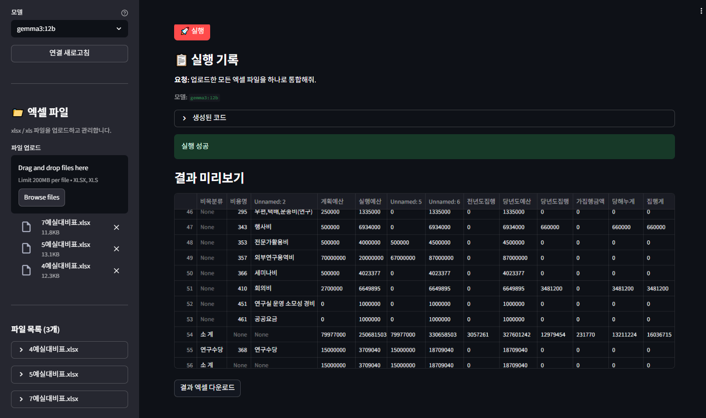

# LLM Agent Lab

자연어 요청을 **Python 코드로 변환·실행**하는 확장형 AI 에이전트 실험 프로젝트입니다.  
로컬 **[Ollama](https://ollama.com)** 모델로 동작하며, 첫 번째 기능으로 **엑셀 파일 업로드 및 프롬프트 기반 데이터 처리**를 제공합니다.

- 실행화면
  - 

## 개요

| 항목 | 설명 |
|------|------|
| UI | Streamlit 대화형 프롬프트 |
| LLM | Ollama 로컬 모델 (왼쪽 사이드바에서 선택) |
| 에이전트 역할 | 사용자 요청 → pandas Python 코드 생성 → 샌드박스 실행 → 결과 반환 |
| 1차 기능 | 다중 엑셀 업로드, 목록/삭제, 통합·연산·집계 등 자연어 처리 |
| 확장 구조 | `agent/base.py` 기반으로 CSV, DB, 차트 등 기능 에이전트 추가 가능 |

### 동작 흐름

```
[Ollama 연결] → [엑셀 업로드] → [파일 메타데이터 수집] → [LLM 코드 생성] → [CodeExecutor 실행] → [결과]
```

LLM에는 각 파일의 컬럼명, dtype, 미리보기(5행)가 컨텍스트로 전달되어 정확한 코드를 생성합니다.

## 주요 기능

### 1. Ollama 연동 (사이드바)
- **연결 상태**: Ollama 서버 온라인/오프라인 표시
- **모델 선택**: `ollama list`에 있는 모델을 드롭다운에서 선택
- **새로고침**: 모델 목록·연결 상태 갱신

### 2. 엑셀 파일 관리 (사이드바)
- **업로드**: xlsx / xls 다중 업로드
- **목록 확인**: 파일명, 행/열 수, 상위 5행 미리보기
- **삭제**: 개별 파일 제거

### 3. 프롬프트 기반 데이터 처리
자연어로 작업을 설명하면 에이전트가 pandas 코드를 작성해 실행합니다.

**예시 요청**
- "업로드한 모든 엑셀 파일을 하나로 통합해줘."
- "동일한 표 구조를 가진 파일들을 하나로 합치고, 숫자 항목은 평균값으로 계산해줘."
- "모든 파일을 세로로 붙인 뒤 중복 행을 제거해줘."

### 4. 실행 결과
- 생성된 Python 코드 확인
- 결과 DataFrame 미리보기
- 결과 엑셀 다운로드
- 실행 기록(요청·코드·모델·성공/실패) 유지

## 프로젝트 구조

```
llm-agent-lab/
├── app.py                    # Streamlit 메인 UI
├── config.py                 # 경로·Ollama 설정
├── requirements.txt
├── .env.example
├── agent/
│   ├── base.py               # 확장용 에이전트 베이스 클래스
│   ├── code_agent.py         # LLM 코드 생성 + 실행 오케스트레이션
│   ├── executor.py           # 생성 코드 샌드박스 실행
│   └── prompts.py            # 시스템/유저 프롬프트
├── services/
│   ├── excel_service.py      # 엑셀 읽기·메타데이터·다운로드
│   └── ollama_service.py     # Ollama 연결·모델 목록
└── utils/
    └── session_state.py      # Streamlit 세션 상태
```

## 사전 요구 사항

- Python 3.10+
- [Ollama](https://ollama.com) 설치 및 실행
- 코드 생성에 사용할 모델 pull (예: `ollama pull llama3.2`)
우
```bash
# Ollama 설치 후 (Linux 예시)
curl -fsSL https://ollama.com/install.sh | sh
ollama serve          # 별도 터미널에서 실행하거나 systemd로 상시 실행
ollama pull llama3.2  # 사용할 모델 다운로드
```

## 설치 및 실행

### 1. 저장소 클론

```bash
git clone https://github.com/ChulseoungChae/llm-agent-lab.git
cd llm-agent-lab
```

### 2. 의존성 설치

```bash
python -m venv .venv
source .venv/bin/activate   # Windows: .venv\Scripts\activate
pip install -r requirements.txt
```

### 3. 환경 설정 (선택)

```bash
cp .env.example .env
# 필요 시 OLLAMA_BASE_URL, OLLAMA_MODEL 수정
```

### 4. 앱 실행

```bash
streamlit run app.py
```

브라우저에서 `http://localhost:8501` 이 열립니다. 왼쪽 사이드바에서 Ollama 연결 상태를 확인하고 모델을 선택한 뒤 사용하세요.

## 환경 변수

| 환경변수 | 기본값 | 설명 |
|----------|--------|------|
| `OLLAMA_BASE_URL` | `http://localhost:11434` | Ollama API 서버 주소 |
| `OLLAMA_MODEL` | `llama3.2` | UI 초기 선택 모델 (`ollama list` 이름) |
| `OLLAMA_TEMPERATURE` | `0.1` | 코드 생성 temperature |
| `OLLAMA_MAX_TOKENS` | `4096` | 최대 토큰 |

생성된 코드는 `CodeExecutor`에서 제한된 환경으로 실행됩니다.

- 사용 가능: `pandas`, `numpy`, `files`(업로드 파일 dict), `OUTPUT_DIR`
- 최종 결과: `result` (DataFrame)
- 파일 저장 시: `saved_files` 리스트에 경로 추가

## 기능 확장 방법

1. `agent/base.py`의 `BaseAgent`를 상속해 새 에이전트 클래스 작성
2. 필요 시 `services/`에 도메인 서비스 추가 (예: `csv_service.py`)
3. `app.py` 또는 별도 Streamlit 페이지에서 에이전트 연결

`CodeAgent` + `CodeExecutor` 패턴을 재사용하면 "요청 → 코드 생성 → 실행" 방식의 기능을 빠르게 추가할 수 있습니다.

## 제한 사항

- 생성 코드는 업로드된 `files`만 사용 (외부 파일/네트워크/os 명령 금지)
- 복잡한 요청은 로컬 모델 품질에 따라 코드가 달라질 수 있음
- 대용량 엑셀은 Streamlit 메모리/속도 한계 있음

## 라이선스

오픈 소스 프로젝트입니다. 자유롭게 사용·수정·배포할 수 있습니다.
